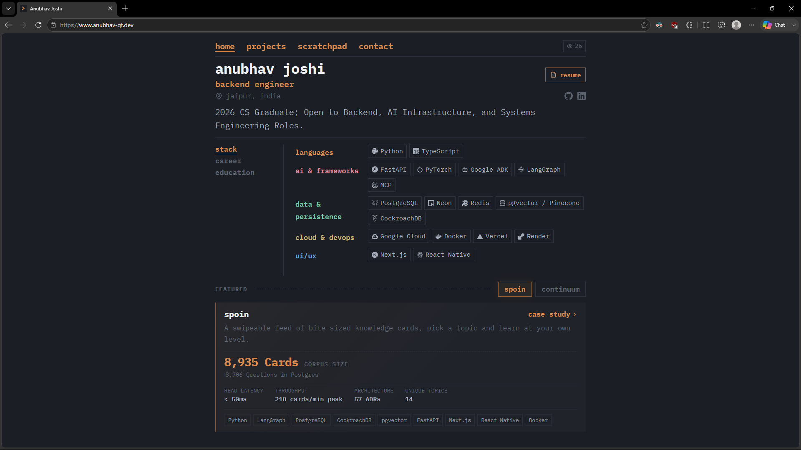
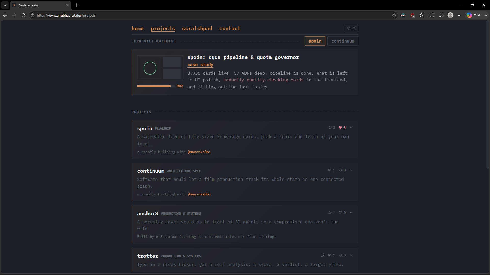
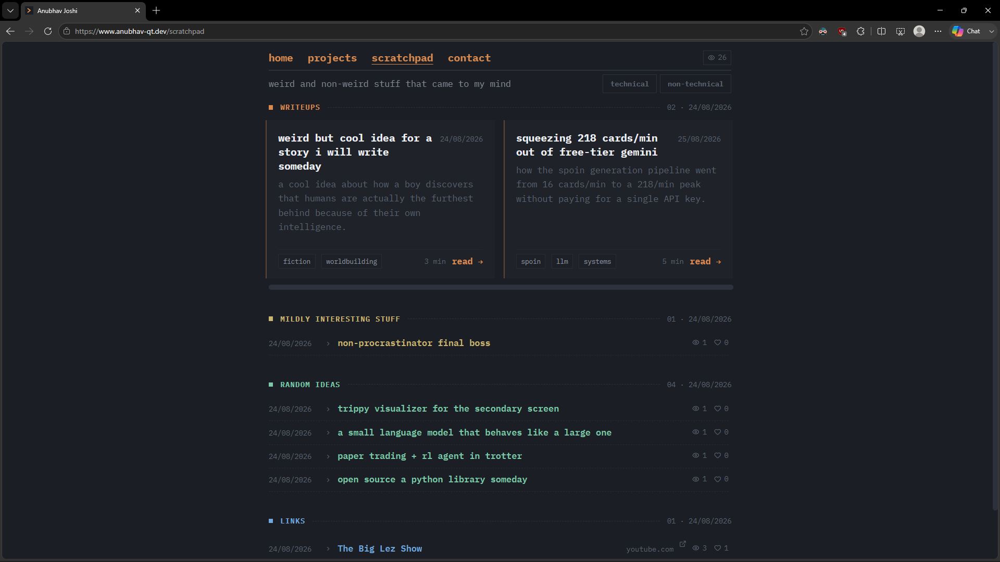
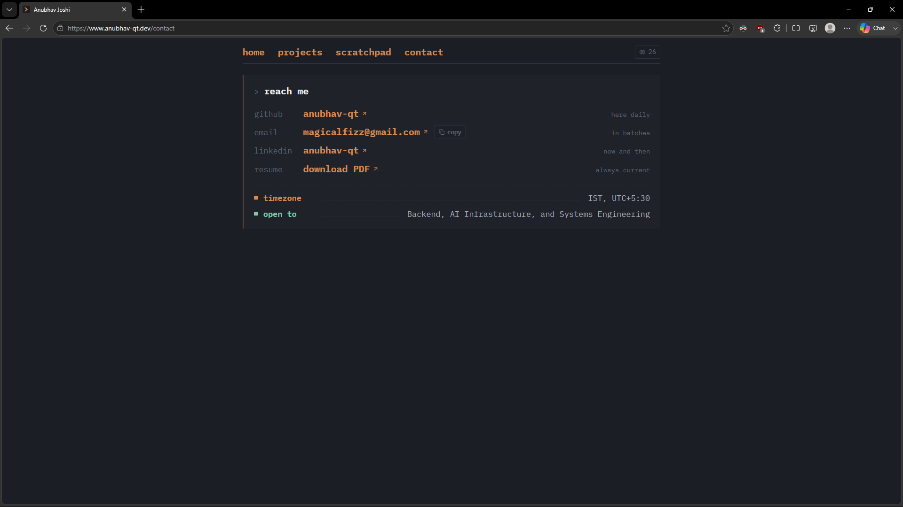

# my_website_v3.1

```
──────────────────────────────────────────
  personal site + dev log
──────────────────────────────────────────
```
live at **[anubhav-qt.dev](https://www.anubhav-qt.dev)**

<table>
<tr>
<td></td>
<td></td>
</tr>
<tr>
<td></td>
<td></td>
</tr>
</table>

**Stack**: React 19 · TypeScript · Vite · Tailwind v4 · Vercel · Supabase (Postgres + Edge Functions)

## Quickstart

```bash
cd frontend
npm install
npm run dev          # http://localhost:5173
```

Backend features (topics, comments, likes, views) degrade quietly to "not available" until
`.env.local` has real Supabase credentials — the site runs fine without them.

```bash
cp .env.example .env.local   # then fill in VITE_SUPABASE_URL / VITE_SUPABASE_ANON_KEY
```

## Scripts

Run from `frontend/`:

```bash
npm run build                    # typecheck, build, prerender to static HTML
npm run lint                     # oxlint
npm run test                     # simulator engine unit tests
npm run sync-docs                # pull ADR/architecture docs into src/data/synced-docs.json
python scripts/update_metrics.py # push a new project metric to Supabase
python scripts/manage_topics.py  # promote/reject/remove live Spoin topics
```

The last two also run as `frontend/scripts/*.bat` on Windows. Both need `.env.local` and
`.secrets.local` (admin secret) in `frontend/`, gitignored.
